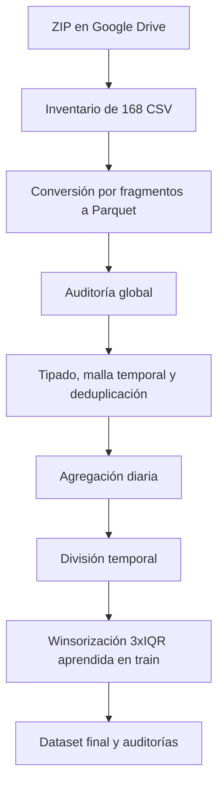
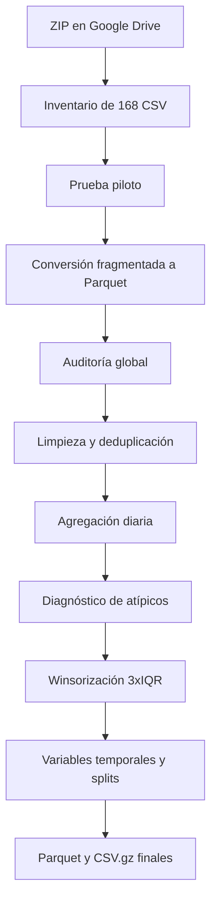

# Predicción concurrente del consumo energético urbano

Trabajo del curso **1ACC0065 – Programación Concurrente y Distribuida**. El proyecto estudia el consumo eléctrico de hogares urbanos a partir del dataset público **SmartMeter Energy Consumption Data in London Households** y prepara una base reproducible para comparar, en las siguientes etapas, una regresión lineal secuencial y otra concurrente en Go.

La PC1 comprende el estado del arte, el caso de uso, la selección del dataset y su preprocesamiento. La implementación y medición del modelo concurrente pertenecen a entregas posteriores; por eso este repositorio no reporta todavía speedup ni resultados de Go.

## Integrantes

| Código | Integrante |
| --- | --- |
| U20231B834 | Rodrigo Alonso Gamero Vera |
| U202210690 | Rodrigo Alonso Ramírez Cesti |
| U202218729 | Sebastian Timana Mendoza |

## Caso de uso

Se busca predecir el consumo eléctrico diario de un hogar a partir de su historial reciente, su tarifa y variables de calendario. La salida es una cantidad continua en kWh, por lo que se plantea un problema de regresión. El trabajo se relaciona con el **ODS 11: Ciudades y comunidades sostenibles**, debido a su aplicación en la planificación de demanda energética urbana.

El volumen original permite estudiar un problema que no resulta conveniente cargar por completo en memoria y, posteriormente, comparar una ejecución secuencial con una concurrente.

## Dataset

- Fuente oficial: [London Datastore — SmartMeter Energy Consumption Data in London Households](https://data.london.gov.uk/dataset/smartmeter-energy-consumption-data-in-london-households-vqm0d).
- Periodo observado: 23 de noviembre de 2011 al 28 de febrero de 2014.
- Volumen auditado: 167,932,474 lecturas de media hora.
- Hogares: 5,566 en la fuente y 5,559 en el conjunto final para modelado.
- Formato de origen: 168 archivos CSV contenidos en un ZIP de aproximadamente 700 MB.
- Columnas originales: `LCLid`, `stdorToU`, `DateTime` y `KWH/hh (per half hour)`.

Los datos crudos y los archivos finales de gran tamaño no se versionan en Git. Las instrucciones para obtenerlos y la política de almacenamiento se encuentran en [data/README.md](data/README.md).

## Flujo de preprocesamiento



Se utilizó DuckDB para consultar y transformar los archivos desde disco, sin construir un único `DataFrame` con 167 millones de filas. Pandas se reservó para tablas pequeñas y resultados de auditoría.

### Decisiones principales

- Se excluyeron 5,560 consumos nulos porque aparecían fuera de la malla válida de `:00` y `:30`; no se imputaron observaciones inexistentes.
- Se conservaron 2,002,920 lecturas iguales a cero porque pueden representar consumo real nulo.
- Se eliminaron 115,453 filas duplicadas adicionales después de verificar que no tenían conflictos de consumo ni tarifa.
- Se conservaron únicamente días con 48 lecturas válidas para que todos los objetivos diarios representen la misma cobertura.
- La división fue temporal, sin barajar los registros.
- Los límites de atípicos se aprendieron solo con entrenamiento mediante una regla conservadora de `3 × IQR`. Se mantuvieron las variables originales y las limitadas para garantizar trazabilidad.

### Resultado final

| Métrica | Resultado |
| --- | ---: |
| Filas para modelado | 3,285,438 |
| Hogares | 5,559 |
| Nulos | 0 |
| Duplicados | 0 |
| Valores negativos | 0 |
| Entrenamiento | 2,559,364 |
| Validación | 452,163 |
| Prueba | 273,911 |
| Filas limitadas por winsorización | 4,053 (0.1234 %) |

## Estructura del repositorio

```text
.
├── README.md
├── CONTRIBUTING.md
├── notebooks/
│   └── Grupo4_PCD_Preprocesamiento.ipynb
├── docs/
│   ├── INFORME_PC1.md
│   ├── CASO_USO_DATASET.md
│   ├── PREPROCESAMIENTO.md
│   ├── GITFLOW_Y_COMMITS.md
│   └── papers/
│       ├── 01_concurrencia_paralelismo_ml.md
│       ├── 02_regresion_consumo_energetico.md
│       └── 03_procesamiento_paralelo_datos.md
├── data/
│   └── README.md
├── auditoria/
│   └── README.md
├── evidencias/
│   └── README.md
└── scripts/
    └── verificar_entrega.ps1
```

## Ejecución en Google Colab

1. Abrir [notebooks/Grupo4_PCD_Preprocesamiento.ipynb](notebooks/Grupo4_PCD_Preprocesamiento.ipynb) desde GitHub.
2. En Colab, montar Google Drive cuando el notebook lo solicite.
3. Seleccionar el ZIP exacto mediante el selector incluido.
4. Ajustar únicamente la carpeta de salida si se desea conservar los Parquet en otra ubicación.
5. Ejecutar las celdas en orden. El proceso puede reanudarse porque omite los fragmentos ya convertidos correctamente.
6. Revisar las auditorías antes de usar el dataset final.

No es necesario descomprimir todos los CSV al mismo tiempo. El notebook extrae y procesa un fragmento por vez, escribe Parquet comprimido y elimina el CSV temporal.

## Documentación

- [Informe navegable de la PC1](docs/INFORME_PC1.md)
- [Caso de uso y selección del dataset](docs/CASO_USO_DATASET.md)
- [Procedimiento completo de preprocesamiento](docs/PREPROCESAMIENTO.md)
- [Papers revisados](docs/papers/README.md)
- [Git Flow, distribución de aportes y comandos PowerShell](docs/GITFLOW_Y_COMMITS.md)
- [Evidencias requeridas](evidencias/README.md)

## Flujo de trabajo del equipo

El repositorio usa `main` para entregas estables, `develop` para integración y ramas `feature/*` para los aportes. Cada integrante debe trabajar con su propia cuenta y correo verificado, subir únicamente contenido que haya revisado o producido y abrir un Pull Request hacia `develop`. No se deben fabricar, compartir cuentas ni retrofechar commits.

La distribución propuesta y los comandos exactos están en [docs/GITFLOW_Y_COMMITS.md](docs/GITFLOW_Y_COMMITS.md). Antes de la entrega se puede ejecutar:

```powershell
powershell -ExecutionPolicy Bypass -File .\scripts\verificar_entrega.ps1
```

## Estado

- [x] Nueve papers organizados en tres temas.
- [x] Caso de uso y dataset sustentados.
- [x] Preprocesamiento reproducible y auditado.
- [x] Dataset final dividido temporalmente.
- [ ] Implementación secuencial en Go.
- [ ] Implementación concurrente en Go.
- [ ] Comparación de tiempo, speedup y precisión.
- [ ] Verificación de propiedades de concurrencia con Spin.

---

# Anexo técnico: preprocesamiento completo

Las siguientes secciones documentan las decisiones, controles y resultados del
notebook con el nivel de detalle necesario para reproducir y defender el
preprocesamiento. Se mantienen las cifras obtenidas en las auditorías finales.

## 4. Por qué se usó DuckDB y no un flujo convencional con Pandas o NumPy

El ZIP pesa cerca de 700 MB, pero los CSV descomprimidos ocupan varios gigabytes. Cargar todos los archivos juntos en un `DataFrame` de Pandas elevaría todavía más el consumo de memoria debido a las cadenas, fechas y estructuras internas. En una sesión estándar de Google Colab esto puede producir lentitud, intercambio a disco o cierre del entorno por falta de RAM.

NumPy es eficiente con matrices numéricas homogéneas, pero el origen mezcla identificadores, texto, marcas de tiempo y valores que deben validarse antes de convertirse a números. Por ello no es la herramienta principal para la etapa de ingestión y auditoría.

Se eligió DuckDB porque permite:

- consultar y agregar datos con SQL sin construir un único `DataFrame` de 167 millones de filas;
- limitar la memoria y usar un directorio temporal en disco;
- convertir cada CSV por separado y descartar el archivo temporal al terminar;
- leer muchos Parquet como una sola vista lógica;
- ejecutar conteos, cuantiles, ventanas y validaciones directamente sobre datos almacenados en disco.

Pandas sí se utiliza, pero únicamente para resultados pequeños: tablas de auditoría, vistas previas y archivos CSV de resumen. La documentación oficial de DuckDB describe tanto la [lectura de CSV](https://duckdb.org/docs/lts/data/csv/overview.html) como la [ingestión de CSV y Parquet desde Python](https://duckdb.org/docs/lts/clients/python/data_ingestion.html).

## 5. Flujo general



## 6. Procedimiento de preprocesamiento

### 6.1 Selección del ZIP

El notebook monta Google Drive y muestra un selector para escoger el ZIP exacto. No se busca el archivo por nombre ni se descomprime por completo. La ruta elegida se guarda en `ZIP_PATH` y se reutiliza en todas las etapas.

### 6.2 Inventario e integridad de fragmentos

Antes de leer los datos se inspecciona el contenido del ZIP:

- 168 CSV encontrados;
- numeración continua desde `0` hasta `167`;
- ningún fragmento faltante;
- ningún número repetido;
- un solo esquema de cuatro columnas en todos los archivos.

Esta revisión evita combinar archivos incompletos o con encabezados incompatibles.

### 6.3 Prueba piloto

El primer fragmento, de un millón de filas, se extrae temporalmente y se convierte a Parquet. El piloto permite verificar el flujo antes de procesar todos los archivos.

Resultados principales del piloto:

| Métrica | Resultado |
| --- | ---: |
| Filas | 1,000,000 |
| Hogares | 30 |
| Nulos en energía | 29 |
| Errores al convertir fecha | 0 |
| Errores al convertir energía | 0 |
| Consumos negativos | 0 |
| Consumos iguales a cero | 45,538 |

### 6.4 Normalización y tipado

Cada fragmento se lee inicialmente como texto para no perder valores por inferencias prematuras. Luego se aplican estas reglas:

- `TRIM` elimina espacios al inicio y al final;
- las cadenas vacías pasan a `NULL`;
- `null`, `nan`, `na` y `n/a` se reconocen como ausentes;
- la fecha se convierte mediante `TRY_CAST(... AS TIMESTAMP)`;
- la energía se convierte mediante `TRY_CAST(... AS DOUBLE)`;
- se guardan indicadores para distinguir un nulo original de un error de conversión;
- se conserva `source_file` para rastrear el fragmento de origen.

El uso de `TRY_CAST` evita que un valor defectuoso detenga todo el proceso y permite contarlo en la auditoría.

### 6.5 Conversión fragmentada

La conversión sigue este ciclo para cada CSV:

1. Extraer un solo fragmento a `/content`.
2. Normalizarlo y tiparlo con DuckDB.
3. Escribir un Parquet temporal con compresión ZSTD.
4. Renombrar el archivo temporal solo si la conversión terminó correctamente.
5. Eliminar el CSV temporal.

El proceso puede retomarse: si un `parte_NNN.parquet` ya existe, el fragmento se omite. Los 168 Parquet resultantes ocupan alrededor de 0.37 GB, frente a varios gigabytes de CSV.

### 6.6 Auditoría global

Después de crear una vista sobre todos los Parquet se obtuvo:

| Métrica | Resultado |
| --- | ---: |
| Registros crudos | 167,932,474 |
| Hogares | 5,566 |
| Tipos de tarifa | 2 |
| Primera lectura | 2011-11-23 09:00:00 |
| Última lectura | 2014-02-28 00:00:00 |
| Energías nulas | 5,560 (0.00331%) |
| Errores de fecha | 0 |
| Errores de energía | 0 |
| Consumos negativos | 0 |
| Lecturas iguales a cero | 2,002,920 (1.19269%) |
| Máximo por media hora | 10.761 kWh |

Los 168 archivos también se auditan por separado. Ninguno presentó errores de conversión ni valores negativos.

### 6.7 Tratamiento de nulos y marcas de tiempo

Los 5,560 consumos nulos aparecen en marcas de tiempo que no pertenecen a la malla válida de cada media hora:

| Comprobación | Resultado |
| --- | ---: |
| Nulos fuera de la malla `:00`/`:30` | 5,560 |
| Nulos dentro de la malla | 0 |
| Consumos no nulos fuera de la malla | 0 |

Por este motivo no se imputan con promedio, mediana ni interpolación. Se excluyen al aplicar simultáneamente `energy_kwh IS NOT NULL`, minutos en `(0, 30)` y segundos iguales a cero. Imputarlos habría creado lecturas en instantes que no forman parte de la serie regular.

### 6.8 Tratamiento de ceros

Los valores cero se conservan. Un cero puede representar ausencia real de consumo durante media hora y no equivale automáticamente a un dato faltante. Eliminarlo o sustituirlo aumentaría artificialmente el consumo diario, especialmente en hogares de baja demanda.

### 6.9 Duplicados

La clave natural de una lectura es `household_id + datetime`. Se encontraron:

| Métrica | Resultado |
| --- | ---: |
| Grupos con clave duplicada | 115,453 |
| Filas adicionales | 115,453 (0.06875%) |
| Grupos con distinto consumo | 0 |
| Grupos con mezcla de nulo y valor | 0 |
| Grupos con distinta tarifa | 0 |

Como los duplicados son idénticos, se conserva una sola fila por clave. En SQL se usa `MIN` para seleccionar el valor, decisión válida porque la auditoría previa demostró que no existen conflictos.

### 6.10 Cobertura y frecuencia

Se calcula para cada hogar su primera y última fecha, número de instantes únicos, lecturas esperadas y porcentaje de cobertura. La mediana de cobertura es 99.92245% y 27 hogares quedan por debajo de 90%.

La cobertura es un diagnóstico; no se elimina un hogar únicamente por ese porcentaje. La regla final actúa por día: el modelo usa solo días con 48 lecturas válidas, de modo que cada objetivo diario representa el mismo número de intervalos.

### 6.11 Agregación diaria

Después de filtrar registros válidos y deduplicar se agrupa por hogar, tarifa y fecha. Se calculan:

- número de lecturas del día;
- suma diaria de kWh;
- promedio por media hora;
- cantidad de lecturas iguales a cero;
- primera y última lectura del día.

El resultado contiene 3,510,403 pares hogar-día:

| Estado del día | Filas | Porcentaje |
| --- | ---: | ---: |
| 48 lecturas completas | 3,469,352 | 98.8306% |
| Cantidad distinta de 48 | 41,051 | 1.1694% |

Los días incompletos pueden corresponder a entradas o salidas parciales del panel, interrupciones u otras irregularidades temporales. No se completan artificialmente; se excluyen del dataset del modelo.

### 6.12 Separación temporal

El dataset se divide por fecha, sin barajar las observaciones:

| División | Fechas | Filas finales | Hogares |
| --- | --- | ---: | ---: |
| Entrenamiento | 2011-12-01 a 2013-09-30 | 2,559,364 | 5,556 |
| Validación | 2013-10-01 a 2013-12-31 | 452,163 | 5,214 |
| Prueba | 2014-01-01 a 2014-02-27 | 273,911 | 5,104 |

La separación temporal representa mejor el uso real: se aprende con el pasado y se predice el futuro. Además, todos los cuantiles y límites de atípicos se calculan solo con entrenamiento, evitando que validación o prueba influyan en el preprocesamiento. Esta separación sigue la recomendación general de evitar fuga de información durante las transformaciones: [Scikit-learn — Common pitfalls and recommended practices](https://scikit-learn.org/stable/common_pitfalls.html#data-leakage).

## 7. Análisis de valores atípicos

### 7.1 Primera evaluación con 1.5×IQR

El criterio inicial de caja y bigotes usa:

```text
IQR = Q3 - Q1
límite superior = Q3 + 1.5 × IQR
```

Aplicado por hogar, este criterio marcó:

| División | Filas analizadas | Filas sobre el límite | Porcentaje |
| --- | ---: | ---: | ---: |
| Entrenamiento | 2,708,689 | 66,431 | 2.4525% |
| Validación | 471,085 | 21,483 | 4.5603% |
| Prueba | 289,578 | 15,483 | 5.3467% |

El porcentaje aumenta en validación y prueba. El análisis mensual mostró que gran parte del incremento ocurre en invierno: diciembre de 2013 alcanzó 7.1092% y enero de 2014 5.7568%. También aparecieron hogares con 80% a 100% de días recortados en validación. Esto indica que 1.5×IQR estaba considerando como anomalía parte de la estacionalidad y de los cambios reales de consumo.

La severidad confirma que la mayoría de los casos estaba relativamente cerca del límite. Entre 66% y 71% de los marcados quedaba como máximo 25% por encima del umbral; solo cerca de 5% a 6% de los atípicos superaba el doble del límite.

### 7.2 Sensibilidad con 3×IQR

Al ampliar la cerca a 3×IQR, la proporción marcada por hogar bajó a 0.5380% en entrenamiento, 1.2119% en validación y 1.4228% en prueba. La caída demuestra que el resultado dependía fuertemente del multiplicador elegido.

### 7.3 Regla definitiva

Para evitar un recorte excesivo se aplica una regla conservadora, aprendida solamente con entrenamiento:

```text
IQR_global = 12.286 - 4.629 = 7.657
límite_global = 12.286 + 3 × 7.657 = 35.257 kWh/día

límite_hogar = Q3_hogar + 3 × IQR_hogar
límite_final = máximo(límite_hogar, límite_global)
```

El límite individual se calcula si el hogar tiene al menos 30 días de entrenamiento y un IQR mayor que cero. Si no cumple esas condiciones, se usa el límite global. Tomar el máximo entre ambos límites funciona como un **piso global**: evita que un hogar con consumo históricamente bajo reciba un umbral demasiado pequeño, pero conserva límites más altos en hogares que normalmente consumen más.

Distribución de reglas entre los 5,557 hogares con datos de entrenamiento:

| Regla | Hogares |
| --- | ---: |
| Límite propio mayor o igual al global | 1,069 |
| Piso global porque el límite propio era menor | 4,475 |
| Límite global por falta de historia o IQR válido | 13 |

El ajuste aplicado es:

```text
consumo_ajustado = mínimo(máximo(consumo_original, 0), límite_final)
```

No se detectaron consumos negativos, por lo que el límite inferior de cero actúa como control de seguridad y no modifica datos observados.

## 8. Variables construidas para regresión

Después de winsorizar la serie diaria se vuelven a calcular las variables históricas. Este orden evita que un extremo ya tratado permanezca dentro de los rezagos o promedios móviles.

| Variable | Descripción |
| --- | --- |
| `household_id` | Hogar al que pertenece la observación. |
| `reading_date` | Fecha del consumo objetivo. |
| `tariff_tou` | 1 para tarifa `ToU`, 0 para `Std`. |
| `is_weekend` | Indicador de sábado o domingo. |
| `dow_sin`, `dow_cos` | Codificación cíclica del día de la semana. |
| `month_sin`, `month_cos` | Codificación cíclica del mes. |
| `day_index` | Días transcurridos desde 2011-01-01. |
| `lag_1_kwh` | Consumo ajustado del día anterior. |
| `lag_7_kwh` | Consumo ajustado de siete días antes. |
| `rolling_mean_7_kwh` | Promedio de los siete días previos. |
| `rolling_std_7_kwh` | Desviación estándar de los siete días previos. |
| `final_upper_cap` | Límite aplicado al hogar. |
| `target_was_capped` | Indica si el objetivo superó el límite. |
| `dataset_split` | `train`, `validation` o `test`. |
| `target_daily_kwh_raw` | Consumo diario observado, sin recorte. |
| `target_daily_kwh_capped` | Consumo diario después de winsorizar. |

Solo se conserva una fila si existen siete días consecutivos de historia y los rezagos de uno y siete días corresponden a fechas reales. No se rellenan huecos como si fueran días consecutivos.

## 9. Resultado final

### 9.1 Calidad del dataset

| Control | Resultado |
| --- | ---: |
| Filas | 3,285,438 |
| Hogares | 5,559 |
| Filas con nulos en variables requeridas | 0 |
| Objetivos negativos | 0 |
| Objetivos ajustados sobre su límite | 0 |
| Duplicados por hogar y fecha | 0 |

### 9.2 Efecto de la winsorización

| División | Filas | Ajustadas | Porcentaje | Media original | Media ajustada | Mediana original | Mediana ajustada |
| --- | ---: | ---: | ---: | ---: | ---: | ---: | ---: |
| Entrenamiento | 2,559,364 | 2,128 | 0.0831% | 9.930660 | 9.917452 | 7.674 | 7.674 |
| Validación | 452,163 | 1,139 | 0.2519% | 10.779683 | 10.742796 | 8.376 | 8.376 |
| Prueba | 273,911 | 786 | 0.2870% | 11.416112 | 11.378488 | 8.717 | 8.717 |

En total se modifican 4,053 filas, equivalentes al 0.1234% del dataset definitivo. La mediana no cambia en ninguna división y la reducción de la media queda entre 0.13% y 0.34%. Esto respalda que el tratamiento se limita a casos extremos y no desplaza el centro de la distribución.

El máximo ajustado no tiene que ser 35.257 kWh para todos los hogares. Ese valor es el piso global; algunos hogares conservan límites individuales mayores. Por ello los máximos ajustados son 239.274999 kWh en entrenamiento y 173.910499 kWh en validación y prueba.

### 9.3 Uso recomendado de los dos objetivos

- Entrenar el modelo principal con `target_daily_kwh_capped` para limitar la influencia de extremos severos.
- Evaluar también contra `target_daily_kwh_raw`, especialmente en prueba, para mostrar el rendimiento frente al consumo realmente observado.
- Reportar métricas con ambos objetivos como análisis de sensibilidad. Así la winsorización no oculta el costo de predecir días de demanda excepcional.

## 10. Archivos generados

La última celda del notebook crea en Drive la carpeta `Grupo4_PCD_preprocesado` y copia:

| Archivo | Uso |
| --- | --- |
| `lcl_diario_base.parquet` | Base diaria anterior a la winsorización, útil para auditoría. |
| `lcl_modelo_regresion_winsor_final.parquet` | Dataset definitivo en formato eficiente para análisis. |
| `lcl_modelo_regresion_winsor_final.csv.gz` | Dataset definitivo para leer desde Go con `compress/gzip` y `encoding/csv`. |
| `auditoria_global.csv` | Resumen del origen completo. |
| `auditoria_archivos.csv` | Control de los 168 fragmentos. |
| `patron_nulos.csv` | Distribución temporal de nulos. |
| `nulos_por_hogar.csv` | Nulos agrupados por hogar. |
| `resumen_hogares.csv` | Cobertura y estadísticos por hogar. |
| `muestra_duplicados.csv` | Evidencia de claves repetidas. |
| `auditoria_modelo_winsor_final.csv` | Métricas del dataset definitivo por división. |
| `limite_winsor_global_final.csv` | Cuantiles y límite global aprendidos con entrenamiento. |
| `resumen_limites_winsor_final.csv` | Distribución de reglas de límite. |
| `parametros_preprocesamiento.csv` | Parámetros principales para reproducir el flujo. |

Los datos de gran tamaño no deberían subirse directamente al repositorio Git. Es preferible versionar el notebook, el README, los CSV pequeños de auditoría y un enlace controlado al dataset final. Si el curso exige guardar binarios grandes en GitHub, se debe evaluar Git LFS.

## 11. Ejecución en Google Colab

1. Abrir `Grupo4_PCD_Preprocesamiento.ipynb` en Colab.
2. Ejecutar la primera celda y autorizar el montaje de Google Drive.
3. Seleccionar `Partitioned LCL Data.zip` con el explorador mostrado.
4. Ejecutar las celdas en orden. No es necesario descomprimir manualmente el ZIP.
5. Mantener activa la sesión mientras se convierten los 168 fragmentos. Si una ejecución se interrumpe, los Parquet ya terminados dentro de esa misma sesión se omiten al reanudar.
6. Revisar que aparezca el mensaje `Dataset winsorizado definitivo aprobado.`
7. Ejecutar la sección **Copia de resultados a Drive** y verificar la carpeta `Grupo4_PCD_preprocesado` junto al ZIP.

Los archivos temporales se guardan en `/content`, que se elimina al reiniciar el entorno de Colab. La copia final a Drive es obligatoria si se desean conservar los resultados.

## 12. Veredicto técnico

El preprocesamiento está bien encaminado y es defendible académicamente. No se limita a eliminar nulos: primero caracteriza su origen, verifica conflictos en duplicados, mide cobertura, justifica la agregación diaria, separa temporalmente los datos y analiza la sensibilidad del criterio de atípicos antes de modificar valores.

La decisión más importante es haber descartado 1.5×IQR como regla final. Ese criterio afectaba hasta 5.35% de prueba y recortaba patrones estacionales válidos. La regla híbrida de 3×IQR con piso global reduce el tratamiento a 0.1234% del dataset definitivo, conserva los objetivos originales y evita fuga de información al calcular los límites solo con entrenamiento.

El dataset queda listo para iniciar el modelado de regresión lineal y, posteriormente, comparar la implementación secuencial con la concurrente en Go. Antes de cerrar la PC1 todavía debe integrarse este contenido al informe, añadir las evidencias de commits de todos los integrantes y verificar que los papers cumplan los requisitos de antigüedad y reputación indicados en la rúbrica.

## 13. Reproducibilidad y Git Flow

La documentación y el código reproducible se organizaron de esta manera:

```text
README.md
CONTRIBUTING.md
notebooks/
  Grupo4_PCD_Preprocesamiento.ipynb
docs/
  INFORME_PC1.md
  CASO_USO_DATASET.md
  PREPROCESAMIENTO.md
  GITFLOW_Y_COMMITS.md
  papers/
auditoria/
  README.md
data/
  README.md
evidencias/
  README.md
```

Se recomienda que cada cambio importante tenga un commit propio: inventario, auditoría, deduplicación, análisis de atípicos, dataset definitivo y documentación. Las ramas de características deben integrarse a `develop` y luego a la rama principal siguiendo el flujo acordado por el equipo. No se deben editar las evidencias de commits después de la fecha de entrega.

## 14. Limitaciones

- Se descartan días con una cantidad distinta de 48 lecturas; no se intenta recuperar días parciales.
- La winsorización reduce la influencia de extremos, pero no demuestra que todos los valores ajustados sean errores de medición.
- No se incorporan variables meteorológicas, feriados o características socioeconómicas, que podrían mejorar la predicción.
- La regla por hogar depende de su historial de entrenamiento; hogares nuevos usan el límite global.
- La utilidad final del tratamiento debe confirmarse comparando métricas del modelo con y sin winsorización.

## 15. Referencias técnicas

- Greater London Authority. [SmartMeter Energy Consumption Data in London Households](https://data.london.gov.uk/dataset/smartmeter-energy-consumption-data-in-london-households-vqm0d).
- DuckDB. [CSV Import](https://duckdb.org/docs/lts/data/csv/overview.html).
- DuckDB. [Data Ingestion with Python](https://duckdb.org/docs/lts/clients/python/data_ingestion.html).
- Scikit-learn. [Common pitfalls and recommended practices](https://scikit-learn.org/stable/common_pitfalls.html#data-leakage).
